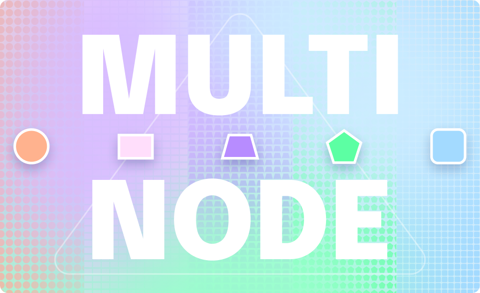

Flow has pioneered a new paradigm of multi-node architecture that solves the core problem of today’s blockchains.
The result is a scalable, decentralized, and secure network which ensures user safety and long-term sustainability.

To better understand the architecture, lets first understand the problems with the current blockchain. Then lets look at how Flow multi-node architecture solves these problems.

# What are the biggest problems solved by Flow's Multi-node Architecture?

## 1. The blockchain trilemma

A blockchain should be fully decentralized, highly scalable and extremely secure. However a well-known problem with all blockchain is the blockchain trilemma - optimizing for any one edge comes at the cost of the other two.

You can have a chain that is decentralized and secure but not scalable e.g. Bitcoin and Ethereum or you can have a chain that is scalable and secure but not as decentralized e.g. Solana, Aptos and Sui.
While multi-chain systems like Cosmos, Layer 2 solutions (L2s) like Polygon, and cross-chain bridges offer innovative approaches to address these challenges, they divide the trust into separate and independent security zones and such zones with fewer validators can be more vulnerable to attacks and therefore less secure.

## 2. Disadvantaging end-users
Most blockchains, regardless of the number of participating nodes, inherently disadvantage individual end-users. This is because (colluding) nodes can censor user transactions or unfairly extract value from users in a phenomenon commonly known as Miner Extractable Value [MEV]. As a result, individual end users can end up paying an “invisible tax” or otherwise seeing their transactions fail due to MEV.

## 3. Energy inefficient and unsustainable
It is well established that Proof-of-Work chains like Bitcoin consume massive amounts of energy, require perpetual hardware upgrades for the miners to stay competitive, and are therefore extremely harmful to the environment. A Proof-of-Stake chain’s environmental impact is less severe, but as web3 applications achieve mainstream adoption, every node in these chains will have to provide more and more hardware resources to meet the increasing throughput demand and the ever growing on-chain state. Vertically scaling the nodes implies higher energy consumption and environmental footprint.

## Multi-node Architecture on Flow

In first-generation smart contract blockchains like Ethereum and Bitcoin, every node in the network performs all of the work associated with processing every transaction (including the entire network’s history, account balances, smart contract code, etc.). While highly secure, it’s also incredibly inefficient, and does not scale throughput (transaction per second, transaction latency) and capacity (on-chain data storage).

Most second-generation blockchain networks focus on improving performance in one of two ways:

1. They compromise decentralization by requiring that participating nodes run on powerful servers (e.g. Solana); or
2. They dramatically increase smart developer complexity by breaking up the network through mechanisms such as sharding (e.g. L2s such as Polygon).

The first approach is vulnerable to platform risk and cartel-like behavior. The second approach outsources the challenges of scaling the platform, effectively handing off the complexities of bridging the different strongly-federated ecosystems to application developers.

Flow offers a new path: pipelining applied to blockchain networks.

Pipelining is a well-established technique across various fields, from manufacturing to CPU design, for significantly increasing productivity.
Flow leverages this concept by distributing the tasks typically handled by a full node in a monolithic blockchain architecture across four specialized roles: Collection, Consensus, Execution, and Verification.
This division of labor between nodes occurs within the different validation stages for each transaction, rather than distributing transactions across different nodes as is done with sharding.
In other words, every Flow node still participates in the validation of every transaction, but they do so only at one of the stages of validation.
They can therefore specialize—and greatly increase the efficiency—for their particular stage of focus.

### Flow node types and what they do

|                                          |   Node type    | Responsibility                                                                                                                              | What do the nodes of this type do?                                                                                                                              |
|------------------------------------------|:--------------:|:--------------------------------------------------------------------------------------------------------------------------------------------|-----------------------------------------------------------------------------------------------------------------------------------------------------------------|
|      |   Collection   | Collection nodes act as a censorship-resistant data availability layer, which caches transactions for subsequent execution.                 | Collection nodes order transactions into batches known as collection.                                                                                           |
|        |   Consensus    | The consensus committee serves as the security authority in the network and orchestrates Flow's transaction processing pipeline.            | Consensus nodes order collections into blocks and commit execution results after verification.                                                                  |
|        |   Execution    | Execution nodes provide the computational resources for executing transactions and maintaining the state.                                   | Execution nodes execute the transaction and record state changes.                                                                                               |
|  |  Verification  | Verification nodes ensure that transactions are truthfully executed.                                                                        | Verification nodes verify the work of the execution nodes. They either approve or disagree with their results, reporting their findings to the consensus nodes. |
|              |     Access     | Access Nodes route transactions into the network and replicate (parts of) the state and transaction results for external clients to query.  | Access node serve the API calls to send and read data from the chain.                                                                                           |

### Further reading
1. [Primer on multi-node architecture](https://flow.com/primer#primer-multinode)
2. [Technical papers](https://flow.com/technical-paper)
3. [Core protocol vision](https://flow.com/core-protocol-vision)
4. [Medium article from Jan which deep dives into the Flow architecture](https://jan-bernatik.medium.com/introduction-to-flow-blockchain-7532977c8af8)

In the next section, lets look at how Flow multi-node architecture solves those three big problems with blockchains.