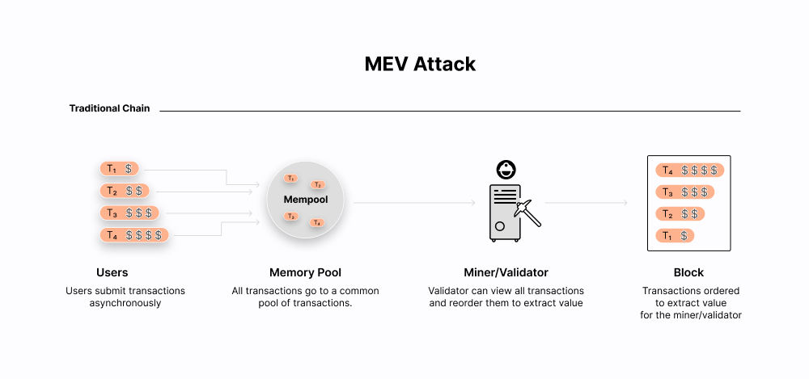
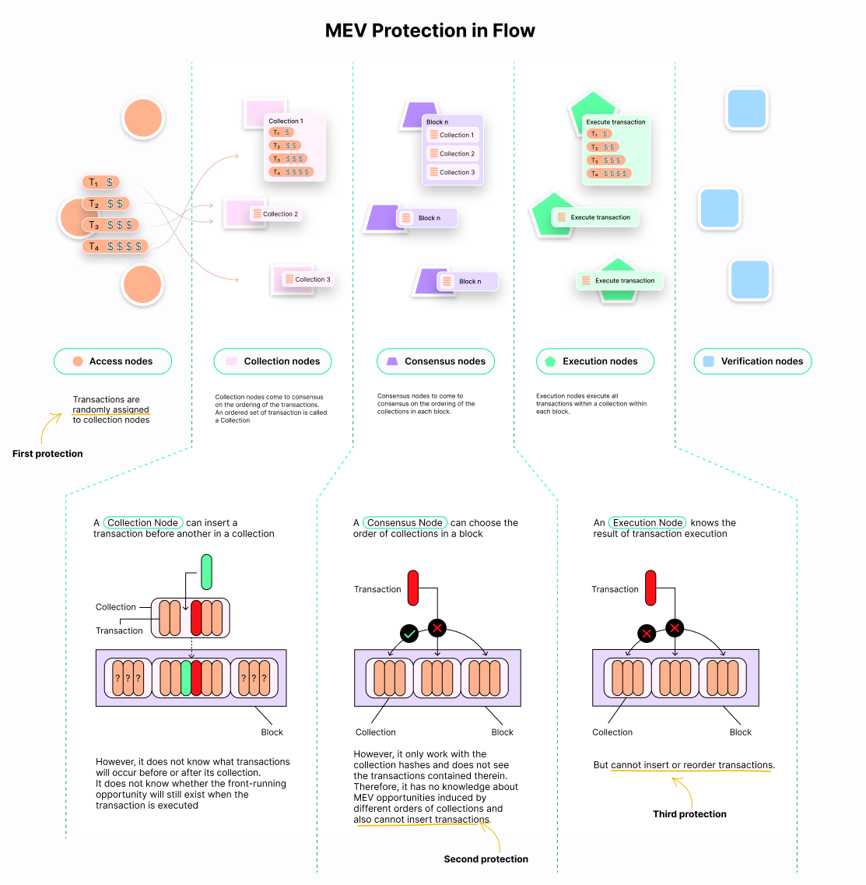

# User Safety with Flow

The monolithic node design of common L1s such as Bitcoin and Ethereum overly privileges operator control over block production.
This makes the chain vulnerable to censorship and MEV attacks. This problem is exacerbated by L2s with centralized sequencers. ERC-4337 is also susceptible to MEV on the user operations via bundlers.

Flow’s multi-node architecture provides censorship & MEV resistance by design:
- Transactions are randomly assigned to collection nodes for inclusion in collections and eventually in blocks. Each collection node only sees a subset of transactions.

- There is already a distinct separation between the proposers (represented by the collection nodes) and the builders (represented by the consensus nodes). This separation essentially provides an inherent implementation of "proposer-builder separation," a concept currently being explored by Ethereum. With this separation, even if the collection nodes were to reorder the transactions, there is no incentive for the consensus nodes to prefer one collection node’s proposal over another.

